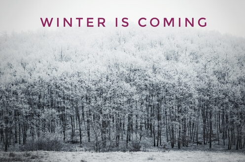

# 2019년 충북대학교병원 알레르기내과 - 본과3학년 실습

## 본과 3학년  알레르기내과 실습을 환영합니다. 

- 기본적인 사항은 전조 학생선생님한테 인계받도록 하세요. 
- 실습 돌면서 물어볼 사항이 있으면 제게 연락하셔도 됩니다.
- 조장은 조원들의 이메일주소/전화번호를 '기타' 폴더의 '학생주소록_2018.csv' 파일에 입력해서 월요일 오전까지 이메일(irreversibly@gmail.com)로 보내주세요. (G-nmail 주소록에 바로 첨부할 수 있도록 파일 형식은 반드시 **'CSV UTF-8(쉼표로 분리)'** 로 저장해주세요)
- 메일을 보낼때는 **'CBNU_본3_알레르기실습]'** 으로 시작하게 보내주세요. (이렇게 보내지 않으면 filtering 되지 않아 메일을 확인하지 못하는 경우가 생깁니다.)
  
## 전반적인 실습 스케쥴은 실습책자를 참고
## 다음 활동에 대해서는 '학습자료' 폴더의 해당 항목 파일을 참고해주세요.  

1. **알레르기 개론 오리엔테이션** (월요일 오전 8~8시 40분, 알레르기내과 외래 또는 교수연구실(서관 931호, PPT 파일) 
2. **피부반응검사/기관지유발검사 실습** 및 해석, 과제제출 (월요일 오전 9~12시, 피부반응검사실)
3. **알레르기 환자 case 발표, 과제제출** (목요일 또는 금요일 점심시간, 환자교육실 또는 교수연구실(서관 931호) 
4. **AIM 기계를 통한 흡입제 환자교육** (화요일 오전 8시 30분~9시, 교수연구실(서관 931호))
6. **약물알레르기 및 약물부작용 관련 교육** (변동 가능, 매주 arrange)

(미완성. 해당 자료는 8/18일 저녁에 추가로 upload 예정)

## 과제물

1. 과제물은 금요일 저녁까지 'CBNU_2019_실습조_이름_과제이름' 형식에 맞춰 이메일(irreversibly@gmail.com)로 보내주세요.  

- 알레르기 환자 case 자료 (워드 또는 한글파일)
- 기관지유발검사/피부반응검사 결과 해석자료 (워드 또는 한글파일)
- 흡입제별 사용법 리뷰자료 (워드 또는 한글파일))

2. 환자 흡입제 교육자료 및 ACT 설문자료(3명 이상)는, 월요일 오전 AIM 기계 사용법을 교육한 후, 배정된 환자들에게 교육을 시행한 후  http://bitly.kr/hhTupY 에서 진행해주세요.  

## reference 

- 공부하면서 참고할 다음 자료는 'reference' 폴더 또는 다음 link에서 다운로드 가능합니다.  

1. 한국 천식 진료 지침 [http://www.allergy.or.kr/file/180629_01.pdf]
2. 알레르기비염 - 임상의를 위한 진료가이드라인 [http://www.allergy.or.kr/file/allergic2015.pdf]
3. 만성기침 진료기침 [http://www.allergy.or.kr/member/sub02_2.html]
4. 충북대병원 권역호흡기센터. 2014. 알레르기검사 동영상 교육자료 [http://bitly.kr/lzk2zf]
5. 알레르기 예방 및 치료 관련 애니메이션자료 [http://e-allergy.org/contents/sub04_06.html]
   1) 천식 예방관리수칙
   2) 알레르기비염 예방관리수칙
   3) 흡입제 터부할러 사용법
   4) 흡입제 디스커스 사용법
   5) 에피네프린 자가주사기 사용법
